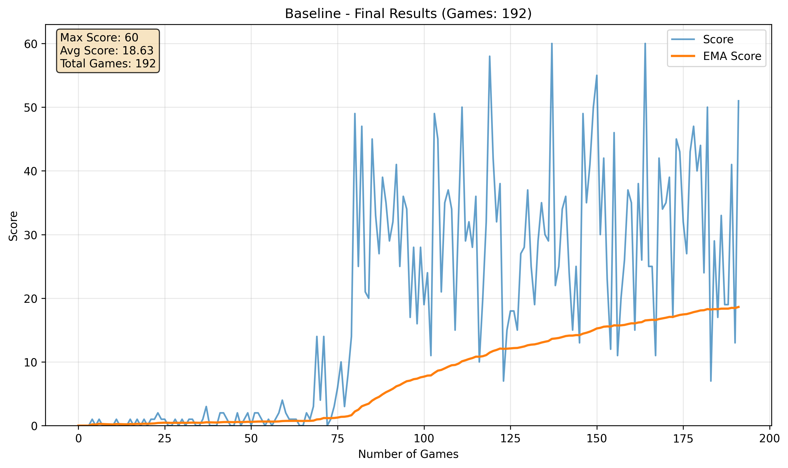
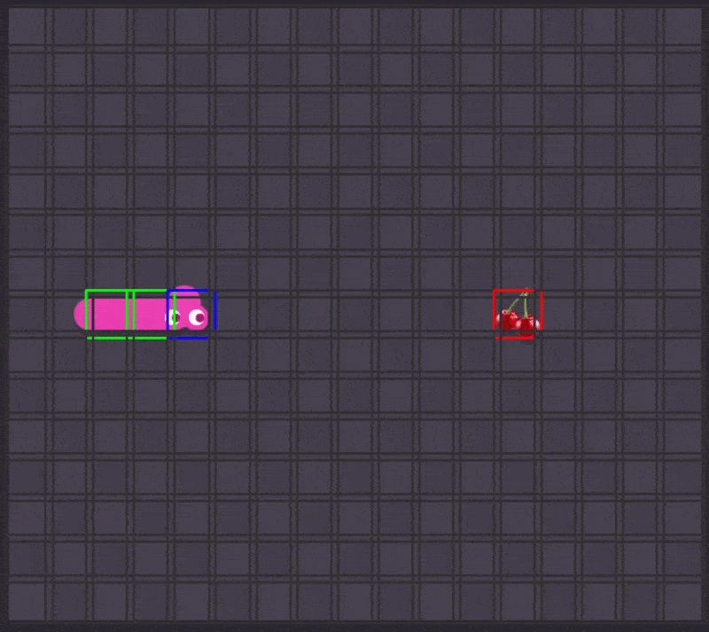

# Screen Capture RL Snake Player (Work in progress)

This project uses computer vision techniques to capture and process the game screen of a Snake game, making it possible to apply reinforcement learning (RL) to control the snake autonomously.

## Table of Contents

- [Tech Stack](#tech-stack)
- [Overview](#overview)
- [Features](#features)
- [Architecture](#architecture)
- [Screen Capture & Grid Detection](#screen-capture--grid-detection)
- [Deep Q-Learning (DQL) Implementation](#deep-q-learning-dql-implementation)
- [Real-Time Visualization](#real-time-visualization)
- [Project Structure](#project-structure)
- [Usage](#usage)

## Tech Stack

## Overview

This system combines computer vision with deep reinforcement learning to play Snake autonomously. It captures the game screen, processes it to detect the game state using advanced computer vision techniques, and uses a trained Deep Q-Network to make optimal movement decisions.

## Features

- **Real-time Screen Capture**: Automatically detects and captures the Snake game window
- **Advanced Grid Detection**: Uses histogram equalization and Hough line detection to identify game board
- **Line Intersection Analysis**: Computes intersections between horizontal and vertical lines to form grid
- **CNN Classification**: MobileNet model classifies each cell as empty, snake body, snake head, or fruit
- **State Correction**: Temporal reasoning to correct CNN misclassifications
- **Deep Q-Learning**: Trained agent that makes optimal movement decisions
- **Real-time Visualization**: Live display with colored grid and direction arrows

## Screen Capture & Grid Detection

### Computer Vision Pipeline

The system employs computer vision techniques to reliably detect the game grid:

<table>
  <tr>
    <td></td>
    <td></td>
    <td></td>
  </tr>
</table>

**Grayscale & Contrast Enhancement:** The image is converted to grayscale and enhanced with histogram equalization to make grid lines more visible.

**Hough Line Detection:** The Probabilistic Hough Transform identifies horizontal and vertical lines, filtering them by orientation and similarity.

**Line filtering:** Remove lines that are too close together. After, remove those that are not horizontal or vertical and through the median of distances and outlier detection we calculate cell size.

**Intersection Mapping:** Detected lines are intersected to generate precise grid points that outline the board layout.

**Grid Construction:** These intersections are sorted into a clean, consistent grid, enabling the system to isolate and extract each cell for later classification.

--- 

## Tile Classification

After the grid is constructed, a MobileNet model—trained on a wide range of skins and color themes—is used to classify each tile.  
To keep processing efficient, the CNN runs inference **only on cells that show meaningful changes between frames**, reducing unnecessary computation.

 

## Deep Q-Learning (DQL) Implementation

### State Representation
The agent observes an 11-dimensional state vector that captures the essential game information:

- **Danger Detection**: Three boolean values indicating danger in front, to the right, and to the left of the snake head
- **Current Direction**: Four boolean values encoding the snake's current movement direction
- **Fruit Location**: Four boolean values indicating the fruit's position relative to the snake head

### Neural Network Architecture
The DQN uses a simple but effective feedforward network with one hidden layer. The network takes the 11-dimensional state vector as input and outputs Q-values for three possible actions: turn left, go straight, or turn right.

### Training Methodology
- **Experience Replay**: Stores and randomly samples past experiences to break correlation between consecutive states
- **Target Network**: Uses a separate target network that updates periodically for stable Q-learning
- **Epsilon-Greedy Exploration**: Balances exploration and exploitation during training
- **Reward Structure**: Provides positive rewards for eating fruit, negative rewards for collisions, and small step penalties to encourage efficiency

## Isolated Training Results

On a simulated environment with perfect information, the model learns pretty good strategies.

  
  

---

# Putting it together (work in progress)

CNN Outputs probabilistic board matrix, then **State Corrector** applies game logic:

Maintains history of previous states and enforces snake movement rules.
Corrects CNN misclassifications using:
- Body connectivity checks
- Fruit persistence tracking  
- Movement validation
- Single head/fruit enforcement

# Results

For now, each of the components work almost flawlessly in isolation, but the combined result looks like the following. This is a work in progress so it is expected to be fixed.

